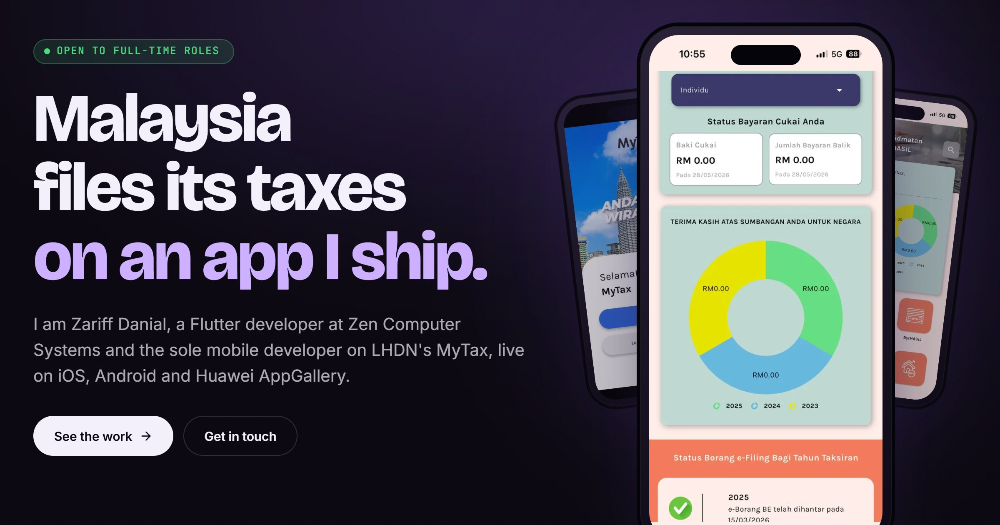

# Zariff Danial, portfolio

[](https://github.com/Zariffdn/Portfolio/actions/workflows/quality.yml)

Live at [zariffdanial.vercel.app](https://zariffdanial.vercel.app/).



A personal site for a Flutter developer: four case studies (MyTax, the Bestinet TOTP work, Silent Support and the fingerprint bag lock final year project), selected projects, a one-page resume, and an about page with experience, education, certifications and a contact form. Dark and light themes, English and Bahasa Malaysia (the four case studies are English only).

## Stack

- React 19 with Vite 8
- react-router-dom 7, react-i18next, framer-motion
- react-pdf for the resume page
- A token-based design system in plain CSS (`src/styles/tokens.css`, no CSS framework), with self-hosted variable fonts (Bricolage Grotesque, Inter, JetBrains Mono)
- Vitest for tests, ESLint 10 for lint, Playwright plus axe-core for the browser quality sweep
- Deployed on Vercel, with a static page per route for crawlers, a Content-Security-Policy and security headers

## Running it

```
npm install
npm run dev        # http://localhost:3000
npm run build      # production build to dist/
npm run preview    # serve dist/ locally
npm run lint
npm test           # unit tests and the contract checks in src/contract.test.js
npm run qa         # build first; screenshots every route in both themes and both viewports in English, plus Bahasa Malaysia on the dark theme, then runs axe
```

Node 22 or newer.

## Checks

- Every push to `main` and every pull request runs lint, tests, the build and the browser sweep ([quality.yml](.github/workflows/quality.yml)).
- Every Monday, [weekly.yml](.github/workflows/weekly.yml) checks every external link (`node tools/qa/links.mjs`) and what the live site serves for each route (`node tools/qa/production.mjs`).
- Dependabot opens dependency updates monthly.

## Where things live

- Pages: `routes.mjs` lists every route; the build, the sweep and the contract tests all read it
- Copy: `src/i18n/locales/en.json` and `ms.json` (keep the two in sync)
- Projects: `src/data/projects.js`; screenshots and store links: `src/data/screenshots.js`, `src/data/mytax.js`
- Fonts: `src/Assets/fonts/` (with their OFL licences), declared in `src/styles/fonts.css`
- Design contract: `docs/DESIGN.md`; architecture notes for tooling: `CLAUDE.md`
- Resume source: `tools/resume/resume.html`, rebuilt to `public/Zariff-Danial-Resume.pdf` with `node tools/resume/build.js`; it is served at the stable URL `/Zariff-Danial-Resume.pdf` (and `/resume.pdf`)

## Credit

The design direction, the content and the decisions are mine. Much of the code was written with Claude Code as a pair programmer, which the co-author lines in the commit history record. If you fork it, a link back to [Zariffdn/Portfolio](https://github.com/Zariffdn/Portfolio) is appreciated.
